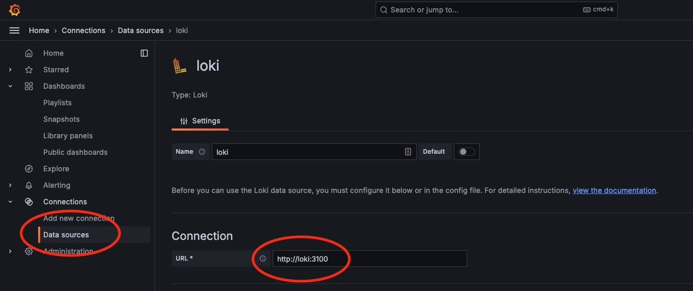
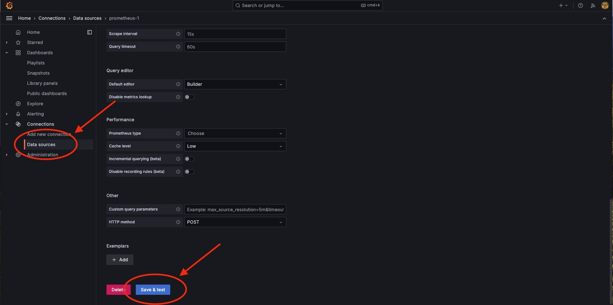

# Prometheus + Loki + Grafana based Log Analytics and Metrics for JFrog Artifactory, Xray

The JFrog Log Analytics and Metrics solution using Prometheus consists of three segments,

1. Prometheus - the component where metrics data gets ingested
2. Loki - the component where log data gets ingested
3. Grafana - the component where data visualization is achieved via prebuilt dashboards

## Pre-Requisites

1. Working and configured Kubernetes Cluster - Amazon EKS / Google GKE / Azure AKS / Docker Desktop / Minikube
   1. Recommended Kubernetes Version 1.25.2 and above
   2. For Google GKE, refer [GKE Guide](https://cloud.google.com/kubernetes-engine/docs/how-to)
   3. For Amazon EKS, refer [EKS Guide](https://docs.aws.amazon.com/eks/latest/userguide/getting-started.html)
   4. For Azure AKS, refer [AKS Guide](https://docs.microsoft.com/en-us/azure/aks/)
   5. For Docker Desktop and Kubernetes, refer [Docker Guide](https://docs.docker.com/desktop/kubernetes/)

2. `kubectl` utility on the workstation which is capable of connecting to the Kubernetes cluster
   1. For Installation and usage refer [kubectl setup](https://kubernetes.io/docs/tasks/tools/#kubectl)

3. `helm` v3 Installed
   1. For Installation and usage refer [helm setup](https://helm.sh/docs/intro/install/)

4. Versions supported and Tested:

   1. Artifactory: 7.111.10
   2. Xray: 3.118.20
   3. Prometheus: 3.4.1
   4. Grafana: 12.0.2
   5. Loki: 2.9.6

## Read me before installing

### Important Note: This version replaces all previous implementations. This version is not an in-place upgrade to the existing solution from JFrog but is a full reinstall. Any dashboard customizations done on previous versions will need to be redone.

```
This guide assumes the implementer is performing new setup. Changes to handle install in an existing setup will be highlighted where applicable.
If prometheus is already installed and configured, we recommend to have the existing prometheus release name handy.
If Loki is already installed and configured, we recommend to have its service URL handy.
```

If Prometheus and Loki are already available you can skip the installation section and proceed to [Configuration Section](#Configuration).

> [!WARNING]
>
> The old docker registry `partnership-pts-observability.jfrog.io`, which contains older versions of this integration is now deprecated. We'll keep the existing docker images on this old registry until August 1st, 2024. After that date, this registry will no longer be available. Please `helm upgrade` your JFrog kubernetes deployment in order to pull images as specified on the above helm value files, from the new `releases-pts-observability-fluentd.jfrog.io` registry. Please do so in order to avoid `ImagePullBackOff` errors in your deployment once this registry is gone.

# Installation

## Installing Prometheus, Grafana and Loki

The Prometheus Community [kube-prometheus-stack](https://github.com/prometheus-community/helm-charts/tree/main/charts/kube-prometheus-stack) helm chart allows the creation of Prometheus instances and includes Grafana.
The Grafana Community [grafana](https://github.com/prometheus-community/helm-charts/tree/main/charts/kube-prometheus-stack) helm chart allows the creation of Loki instances and includes Grafana which can link to prometheus.

Once the Pre-Requisites are met, to install Prometheus Kubernetes stack:

1. Create the namespace required for the kubernetes deployment

   We use `jfrog-plg` as the namespace throughout this document. That said, you can use a different or existing namespace.

```shell
export INST_NAMESPACE=jfrog-plg
```

```shell
kubectl create namespace ${INST_NAMESPACE}
```

2. Add the required Helm Repositories

```shell
helm repo add prometheus-community https://prometheus-community.github.io/helm-charts
helm repo update
```

3. Install Prometheus and Grafana

```shell
helm upgrade --install prometheus prometheus-community/kube-prometheus-stack -n ${INST_NAMESPACE}

# "prometheus" here is the value that needs to be used against the value for "release_name" in the configuration section

# Needed to add --set prometheus.prometheusSpec.maximumStartupDurationSeconds=600 to avoid an error (bug?)
```

4. For Docker Desktop

   Run this additional command to correct the mount path propagation for prometheus node-exporter component.

   An error event will be appearing as follows "Error: failed to start container "node-exporter": Error response from daemon: path / is mounted on / but it is not a shared or slave mount"

```shell
kubectl patch ds prometheus-prometheus-node-exporter --type json -p '[{"op": "remove", "path" : "/spec/template/spec/containers/0/volumeMounts/2/mountPropagation"}]' -n ${INST_NAMESPACE}
```

5. Install Loki


```shell
# Add the required Helm Repositories
helm repo add grafana https://grafana.github.io/helm-charts
helm repo update
```


```shell
# Install the Loki chart
helm upgrade --install loki --values helm/loki-values.yaml grafana/loki --version 5.48.0 -n ${INST_NAMESPACE}
```

:bulb: The above helm command is hard-coding the `loki` chart version to 5.48.0, since we only tested it with `loki` 2.9.6. `loki` 3.x charts (v6.0.x and up) have a breaking change, so if you would like to install `loki` 3.x please visit the [loki's official docs](https://grafana.com/docs/loki/latest/setup/install/helm/) and provide your own `loki-values.yaml`

```
* "loki" will be the service name, the url to access loki as a datasource can be visualized as http://<service_name>.<namespace>:<port>
  ex: http://loki.${INST_NAMESPACE}:3100 will be the "loki_url" value

* version 2.9.6 is the most recent loki version at the time of writing the document. If there is a need to deploy this exact version, change the version value in "--set loki.image.tag=my_desired_version" to your desired version.
```

## Install Artifactory with Open Metrics

### Artifactory
Installing Artifactory using the official [Helm Chart](https://github.com/jfrog/charts/tree/master/stable/artifactory)

1. Before starting Artifactory or Artifactory HA installation generate join and master keys for the installation:

```shell
export JOIN_KEY=$(openssl rand -hex 32)
export MASTER_KEY=$(openssl rand -hex 32)
```

2. helm installation command (using the above generated join and master keys)

```shell
# Install Artifactory
helm upgrade --install artifactory jfrog/artifactory \
     --set artifactory.masterKey=$MASTER_KEY \
     --set artifactory.joinKey=$JOIN_KEY \
     --set artifactory.metrics.enabled=true \
     -n ${INST_NAMESPACE}
```

:bulb: Metrics collection is disabled by default in Artifactory. Please make sure that you are enabling them in Artifactory by setting `artifactory.metrics.enabled` to `true` in your [helm values file](helm/artifactory-values.yaml). For Artifactory versions <=7.86.x, please instead set the flag `artifactory.openMetrics.enabled` to `true

3. Follow the instructions how to get your new Artifactory URL from the helm install output

```shell
export SERVICE_IP=$(kubectl get svc --namespace ${INST_NAMESPACE} artifactory-artifactory-nginx -o jsonpath='{.status.loadBalancer.ingress[0].ip}')
echo http://$SERVICE_IP/
```

4. Using the Artifactory UI, generate an [admin access token](https://jfrog.com/help/r/how-to-generate-an-access-token-video/artifactory-creating-access-tokens-in-artifactory). Using the generated token, create a kubernetes generic secret for the token - using one of the following methods

```shell
kubectl create secret generic jfrog-admin-token --from-file=token=<path_to_token_file> -n ${INST_NAMESPACE}
```
OR
```shell
kubectl create secret generic jfrog-admin-token --from-literal=token=<JFROG_ADMIN_TOKEN> -n ${INST_NAMESPACE}
```

5. The PostgreSQL password is required to upgrade Artifactory. Run the following command to get the current PostgreSQL password
```shell
POSTGRES_PASSWORD=$(kubectl get secret -n ${INST_NAMESPACE} artifactory-postgresql -o jsonpath="{.data.postgres-password}" | base64 --decode)
```

6. Upgrade Artifactory with the custom values in [helm/artifactory-values.yaml](helm/artifactory-values.yaml) to create additional kubernetes resources, which are required for Prometheus service discovery process.

**💡Note: You need to be at the root of this repository folder to have `helm/artifactory-values.yaml` file available for the following command**

```shell
# Upgrade Artifactory
helm upgrade --install artifactory jfrog/artifactory \
     --set artifactory.joinKey=$JOIN_KEY \
     --set databaseUpgradeReady=true --set postgresql.auth.password=$POSTGRES_PASSWORD \
     -f helm/artifactory-values.yaml \
     -n ${INST_NAMESPACE}
```


This will complete the necessary configuration for Artifactory and expose new service monitors `servicemonitor-artifactory` and `servicemonitor-observability` to expose metrics to Prometheus


## Install Xray with Open Metrics

To configure and install Xray with Prometheus metrics being exposed use our file `helm/xray-values.yaml` to expose a metrics and new service monitor to Prometheus.

### Xray

1. Generate a master key for the Xray installation:

```shell
export XRAY_MASTER_KEY=$(openssl rand -hex 32)
```

2. Use the same `JOIN_KEY` from the Artifactory installation, in order to connect Xray to Artifactory. You'll also be using the `jfrog-admin-token` kubernetes secret, that was created earlier as part of Artifactory installation

**💡Note: You need to be at the root of this repository folder to have `helm/xray-values.yaml` file available for the following command**

```shell
# Getting the Artifactory URL
export JFROG_JPD=$(kubectl get svc -n ${INST_NAMESPACE} artifactory-artifactory-nginx -o jsonpath='{.status.loadBalancer.ingress[0].ip}')
# OR
export JFROG_JPD=$(kubectl get svc -n ${INST_NAMESPACE} artifactory-artifactory-nginx -o jsonpath='{.status.loadBalancer.ingress[0].hostname}')

echo $JFROG_JPD

# Install xray
helm upgrade --install xray jfrog/xray --set xray.jfrogUrl=http://$JFROG_JPD \
     --set xray.masterKey=$XRAY_MASTER_KEY \
     --set xray.joinKey=$JOIN_KEY \
     -f helm/xray-values.yaml \
     -n ${INST_NAMESPACE}
```

# Configuration

## Access the Prometheus UI

Use 'kubectl port forward' as mentioned below in a separate terminal window

```shell
kubectl port-forward service/prometheus-operated 9090:9090 -n ${INST_NAMESPACE}
```

Go to the web UI of the Prometheus instance http://localhost:9090 and verify "Status -> Service Discovery", the list shows the new ServiceMonitor for Artifactory or Xray or both, as shown here:

## To Assess the setup for Grafana

use 'kubectl port forward' as mentioned below in a separate terminal window

```shell
kubectl port-forward service/prometheus-grafana 3000:80 -n ${INST_NAMESPACE}
```

1. Open your Grafana on a browser at http://localhost:3000 (grafana default credentials are `admin` / `prom-operator`).

2. Go to "Configuration" -> "Data Sources" on the left menu:
   

3. Add your Prometheus instance and Loki Instance as datasources:
   * Loki data source: Specify url value as `http://loki:3100`
   * Prometheus data source might be added from config automatically. If not, add Prometheus data source and specify url value as `http://prometheus-kube-prometheus-prometheus:9090/`
   

4. While specifying datasource url for `Loki` and `Prometheus`, please test and confirm that the connection is successful by using the `Save & Test` button at the bottom of the adding data source page:

   

   After adding both `Loki` and `Prometheus` Data Sources your "Configuration" -> "Data Sources" page should look like the following:
   

## Artifactory and Xray Grafana Dashboards

Example dashboards are included in the [grafana](grafana) directory. These dashboards need to be imported to Grafana. These include:

- Artifactory Metrics and Log Analytics Dashboard [Download Here](grafana/ArtifactoryLogAnalyticsAndSystemMetrics.json)
- Artifactory Application Metrics (Open Metrics) Dashboard [Download Here](grafana/ArtifactoryMetrics.json)
- Xray Metrics and Log Analytics Dashboard [Download Here](grafana/XrayLogAnalyticsAndSystemMetrics.json)

After downloading the dashboards go to "Dashboards" -> "Import":


Pick `Upload JSON file` and upload Artifactory and Xray dashboards files that you downloaded in the previous step.

Import the Dashboards and select the appropriate sources (Loki and Prometheus)


## References

* [Grafana Dashboards](https://grafana.com/docs/grafana/latest/features/dashboard/dashboards/)
* [Grafana Queries](https://prometheus.io/docs/prometheus/latest/querying/basics/)
* [Loki Queries](https://grafana.com/docs/loki/latest/query/)
