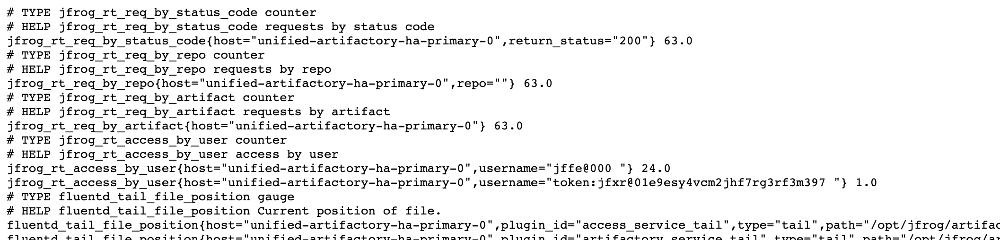
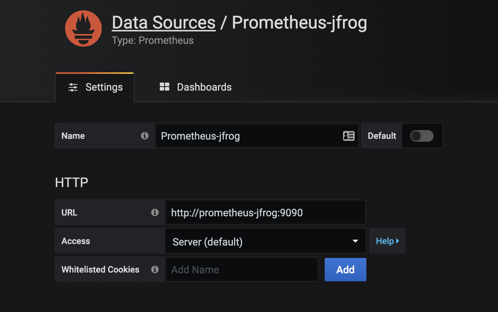
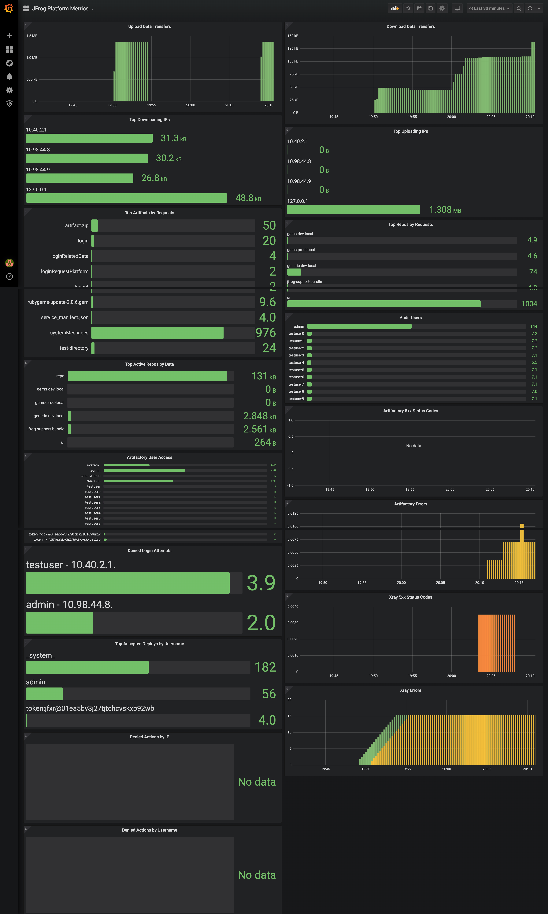

# Artifactory and Xray Logging Analytics with FluentD, Prometheus and Grafana
The following describes how to configure Prometheus and Grafana to gather metrics from Artifactory and Xray through the use of FluentD. The setup and configuration of Prometheus and Grafana uses Kubernetes and makes use of the Prometheus Operator.

| version | artifactory | xray  | distribution | mission_control | pipelines |
|---------|-------------|-------|--------------|-----------------|-----------|
| 0.5.0   | 7.7.3       | 3.8.0 | N/A          | N/A             | N/A       |
| 0.4.0   | 7.7.3       | 3.8.0 | N/A          | N/A             | N/A       |
| 0.3.0   | 7.7.3       | 3.8.0 | N/A          | N/A             | N/A       |
| 0.2.0   | 7.7.3       | 3.8.0 | N/A          | N/A             | N/A       |
| 0.1.1   | 7.6.3       | 3.6.2 | N/A          | N/A             | N/A       |

## Installing Prometheus and Grafana (via Operator) on K8s
The [Prometheus Operator](https://coreos.com/operators/prometheus/docs/latest/) allows the creation of Prometheus instances and includes Grafana. Install the Prometheus Operator via Helm 3:

```
helm install jfrog-prometheus stable/prometheus-operator
```

## FluentD Configuration
The following steps describe how to configure FluentD to gather metrics for Prometheus. Refer to the main [README](../../README.md) for more details.
1. Install the [FluentD Prometheus Plugin](https://github.com/fluent/fluent-plugin-prometheus).
2. Use the appropriate FluentD configuration file and copy it to /etc/td-agent/td-agent.conf.
    * fluent.conf.rt - Artifactory version 7 server
    * fluent.conf.rt6 - Artifactory version 6 server
    * fluent.conf.xray - Xray server (3.x+)
3. Restart td-agent.
4. In order to expose the /metrics interface for Prometheus to scrape, apply the appropriate *-metrics-service.yaml.

```
eg.
kubectl apply -f artifactory-ha-member-metrics-service.yaml
```
5. The /metrics interface is now available at http://<service>:24231/metrics


## Configuring Prometheus to Gather Metrics from Artifactory and Xray on K8s
The following steps using the Prometheus Operator to create a Prometheus instance and the ServiceMonitor to gather metrics. The [ServiceMonitor](https://coreos.com/operators/prometheus/docs/latest/user-guides/running-exporters.html) resource tells Prometheus where the metrics service. This metrics service provides the metrics data for the Prometheus "scrapes".
1. Create a new Prometheus instance.
```
kubectl apply -f prometheus-jfrog.yaml
```
2. Apply the RBAC manifest to allow Prometheus to monitor for new ServiceMonitors.
```
kubectl apply -f prometheus-rbac.yaml
```
3. Create the appropriate ServiceMonitor to gather metrics.
```
kubectl apply -f servicemonitor-*.yaml

eg.
kubectl apply -f servicemonitor-artifactory-ha-member.yaml
```
4. Go to the web UI of the Prometheus instance create in Step 1 and verify the Targets list shows the new ServiceMonitor.

__
5. Finally, go to Grafana to add your Prometheus instance as a datasource.


## Important: Securing the Metrics Interface
For production use, the metrics interfaces provided by the [FluentD Prometheus Plugin](https://github.com/fluent/fluent-plugin-prometheus) should be secured using TLS. This is done by adding _transport tls_ section to the input plugin _@type prometheus_ [within the provided configuration files](https://github.com/jfrog/log-analytics/blob/master/prometheus-fluentd-grafana/fluent.conf.rt.prometheus#L4).

```
<source>
  @type prometheus
  <transport tls>
    # TLS parameters...
  </transport
</source>
```

The following example sets up the Metrics Interface on HTTPS.

```
<transport tls>
  cert_path /path/to/jfrog.crt
  private_key_path /path/to/jfrog.key
  private_key_passphrase pass
</transport>
```

For client verification (Prometheus or ServiceMonitor as the client), you can also configure the Metrics Interface to validate using the _client_cert_auth_ parameter.

```
<transport tls>
  cert_path /path/to/jfrog.crt
  private_key_path /path/to/jfrog.key
  private_key_passphrase pass
  client_cert_auth true
</transport>
```
For documentation on how to set up Prometheus for TLS using NGINX see [here](https://prometheus.io/docs/guides/tls-encryption/).

## Exposing Prometheus, Grafana and FluentD Metrics Interface for Testing
For testing purposes, you may want to expose Prometheus, Grafana and the FluentD Metrics interface. A test-only-expose.yaml provides an example of how to do this:
```
kubectl apply -f test-only-expose.yaml
```
## Grafana Dashboard
An example dashboard is included in the [grafana directory](grafana).


## Metrics Collected
The following metrics are collected and can be queried using PromQL.
| Metric                 | Product     | Type    | Labels                                                                                    | Description                                       |
|------------------------|-------------|---------|-------------------------------------------------------------------------------------------|---------------------------------------------------|
| jfrog_rt_data_download | Artifactory | gauge   | host, remote_address, repo, response_content_length, data_download                        | Data download in bytes.                           |
| jfrog_rt_data_upload   | Artifactory | gauge   | host, remote_address, repo, request_content_length, data_download                         | Data upload in bytes.                             |
| jfrog_rt_req           | Artifactory | counter | host, remote_address, repo, artifact, request_url, return_status, dockerRepo, dockerImage | Requests to Artifactory.                          |
| jfrog_rt_log_level     | Artifactory | counter | host, log_level                                                                           | Logging level counter (ERROR, WARN, INFO, DEBUG). |
| jfrog_rt_access        | Artifactory | counter | host, username, action_response                                                           | Artifactory user access and response counter.     |
| jfrog_rt_access_audit  | Artifactory | counter | host, user, event_type, event                                                             | Artifactory user event counter.                   |
| jfrog_xray_req         | Xray        | counter | host, remote_address, request_url, return_status                                          | Requests to Xray.                                 |
| jfrog_xray_log_level   | Xray        | counter | host, log_level                                                                           | Logging level counter (ERROR, WARN, INFO, DEBUG). |


## Fluentd HA Setup
Due to the nature of Prometheus pulling metrics a traditional fluentd ha setup with aggregator server is not supported. Artifactory & Xray HA setup is supported by installation of fluentd per node.

## References
* [FluentD Plugin for Prometheus Metrics](https://github.com/fluent/fluent-plugin-prometheus#supported-metric-types)
* [Grafana Dashboards](https://grafana.com/docs/grafana/latest/features/dashboard/dashboards/)
* [Grafana Queries](https://prometheus.io/docs/prometheus/latest/querying/basics/)
