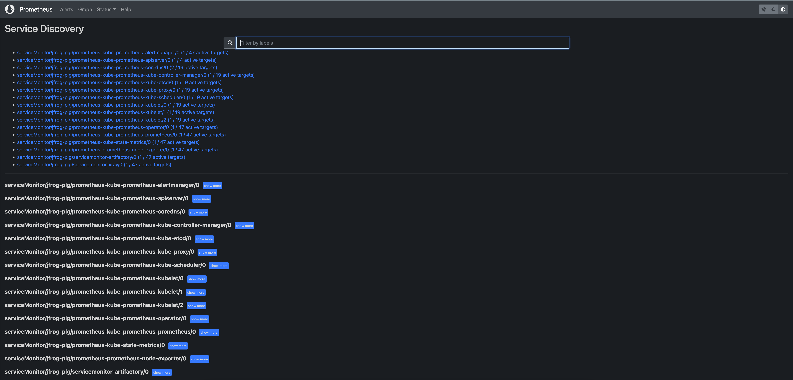
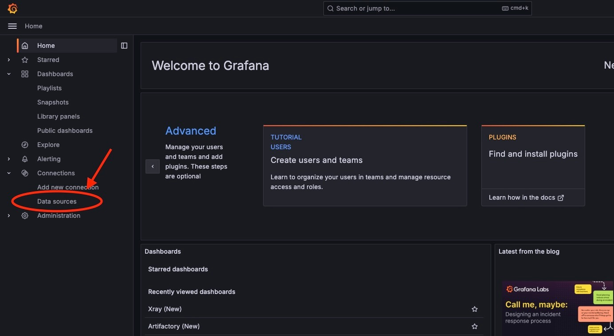
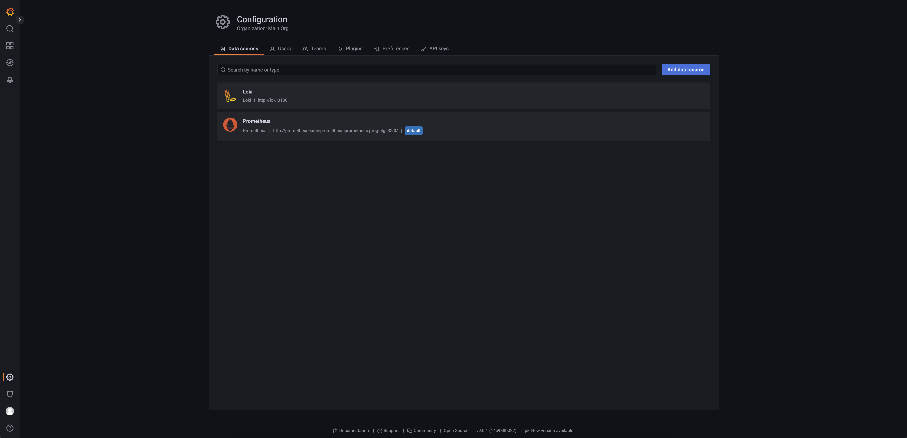
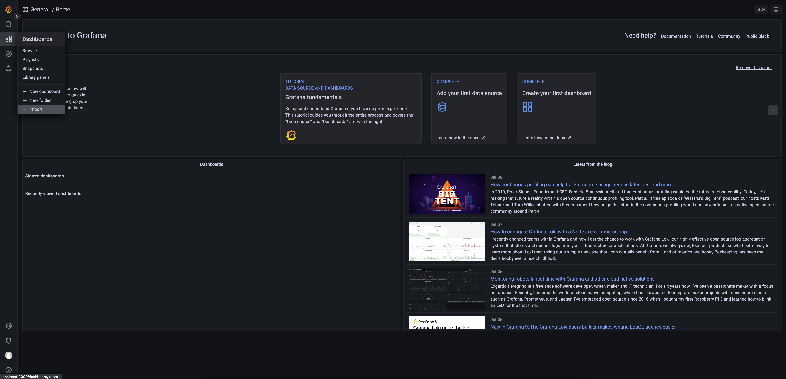
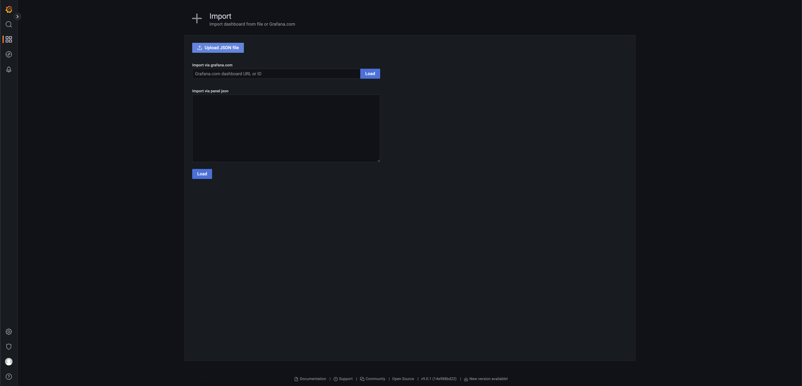
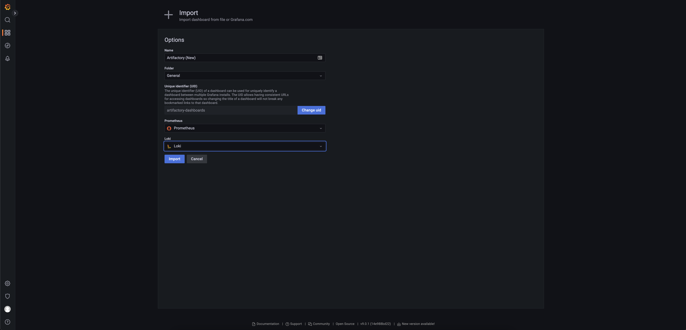

# Prometheus + Loki + Grafana based Log Analytics and Metrics for JFrog Artifactory, Xray

The JFrog Log Analytics and Metrics solution using Prometheus consists of three segments,

1. Prometheus - the component where metrics data gets ingested
2. Loki - the component where log data gets ingested
3. Grafana - the component where data visualization is achieved via prebuilt dashboards

## Pre-Requisites
1. Working and configured Kubernetes Cluster - Amazon EKS / Google GKE / Azure AKS / Docker Desktop / Minikube
   1. Recommended Kubernetes Version 1.20 and Above
   2. For Google GKE, refer [GKE Guide](https://cloud.google.com/kubernetes-engine/docs/how-to)
   3. For Amazon EKS, refer [EKS Guide](https://docs.aws.amazon.com/eks/latest/userguide/getting-started.html)
   4. For Azure AKS, refer [AKS Guide](https://docs.microsoft.com/en-us/azure/aks/)
   5. For Docker Desktop and Kubernetes, refer [DOCKER Guide](https://docs.docker.com/desktop/kubernetes/)
2. 'kubectl' utility on the workstation which is capable of connecting to the Kubernetes cluster
   1. For Installation and usage refer [KUBECTL Guide](https://kubernetes.io/docs/tasks/tools/)
3. HELM v3 Installed
   1. For Installation and usage refer [HELM Guide](https://helm.sh/docs/intro/install/)

## Read me before installing
### Important Note: This is not an upgrade to the existing solution from JFrog, there is no migration feasible.
```html
This guide assumes the implementer is performing new setup, 
    if prometheus is already installed and configured, we recommend to have the existing prometheus release name handy. 
    If Loki is already installed and configured, we recommend to have its service URL handy.

If prometheus and loki are already available you can skip the installation section and proceed to configuration section.
```

# Installation

## Installing Prometheus, Loki and Grafana on Kubernetes
The Prometheus Community [kube-prometheus-stack](https://github.com/prometheus-community/helm-charts/tree/main/charts/kube-prometheus-stack) helm chart allows the creation of Prometheus instances and includes Grafana.
The Grafana Community [grafana](https://github.com/prometheus-community/helm-charts/tree/main/charts/kube-prometheus-stack) helm chart allows the creation of Loki instances and includes Grafana which can link to prometheus.

Once the Pre-Requisites are met, to install Prometheus Kubernetes stack:

#### Create the Namespace required for Prometheus Stack deployment

```
kubectl create namespace jfrog-plg
```

#### Install the Prometheus chart:

Add the required Helm Repositories:
```
helm repo add prometheus-community https://prometheus-community.github.io/helm-charts
helm repo update
```
Install the chart:
```shell
helm install "prometheus" prometheus-community/kube-prometheus-stack -n jfrog-plg
```
```yaml
* "prometheus" here is the value that needs to be used against the value for "release_name" in the configuration section
```
For Docker Desktop, run this additional command to correct the mount path propagation for prometheus node-exporter component,
An error event will be appearing as follows "Error: failed to start container "node-exporter": Error response from daemon: path / is mounted on / but it is not a shared or slave mount"
```shell
kubectl patch ds prometheus-prometheus-node-exporter --type "json" -p '[{"op": "remove", "path" : "/spec/template/spec/containers/0/volumeMounts/2/mountPropagation"}]' -n jfrog-plg
```

#### Install the Loki chart:

Add the required Helm Repositories:
```
helm repo add loki https://grafana.github.io/loki/charts
helm repo update
```
Install the chart:
```shell
helm upgrade --install "loki" grafana/loki-stack -n jfrog-plg --version v2.4.1
```
```yaml
* "loki" will be the service name, the url to access loki as a datasource can be visualised as http://<service_name>.<namespace>:<port>
      ex: http://loki.jfrog-plg:3100 will be the "loki_url" value

* the --version v2.4.1 is the most widely distributed loki version at the time of writing the document
      if there is a need to deploy the latest version, the command would be without the --version v2.4.1
       
```

# Configuration

The configuration which is needed to be put before the JFrog products installation can take place are listed below,

From any of the value files for applying charts i.e in `helm/jfrog-platform-values.yaml`, `helm/artifactory-values.yaml`, `helm/artifactory-ha-values.yaml` or `helm/xray-values.yaml`
download and provide the following values for `global.prometheus.loki_url` and `global.prometheus.release_name` as per the installation if prometheus and loki are already installed

```yaml
global:
   jfrog:
      observability:
         branch: master
   prometheus:
      loki_url: http:\/\/loki.jfrog-plg:3100
      release_name: prometheus
```


## JFrog Platform + Metrics via Helm ⎈

To configure and install JFrog Platform with Prometheus metrics being exposed use our file `helm/xray-values.yaml` to expose a metrics and new service monitor to Prometheus.

JFrog Platform ⎈:
```text
helm upgrade --install jfrog-platform jfrog/jfrog-platform \
       -f helm/jfrog-platform-values.yaml \
       -n jfrog-plg
```

## Artifactory / Artifactory HA + Metrics via Helm ⎈

For configuring and installing Artifactory Pro/Pro-x use the `artifactory-values.yaml` file.

For configuring and installing Enterprise/Ent+ use the `artifactory-ha-values.yaml` file.

You can apply them to your helm install examples below:

Artifactory ⎈:
```text
helm upgrade --install artifactory jfrog/artifactory \
       --set artifactory.masterKey=FFFFFFFFFFFFFFFFFFFFFFFFFFFFFFFFFFFFFFFFFFFFFFFFFFFFFFFFFFFFFFFF \
       --set artifactory.joinKey=EEEEEEEEEEEEEEEEEEEEEEEEEEEEEEEE \
       -f helm/artifactory-values.yaml \
       -n jfrog-plg
```

Artifactory-HA ⎈:
```text
helm upgrade --install artifactory-ha jfrog/artifactory-ha \
       --set artifactory.masterKey=FFFFFFFFFFFFFFFFFFFFFFFFFFFFFFFFFFFFFFFFFFFFFFFFFFFFFFFFFFFFFFFF \
       --set artifactory.joinKey=EEEEEEEEEEEEEEEEEEEEEEEEEEEEEEEE \
       -f helm/artifactory-ha-values.yaml \
       -n jfrog-plg
```

Note the above examples are only references you will need additional parameters to configure TLS, binary blob storage, or other common Artifactory features.

This will complete the necessary configuration for Artifactory and expose a new service monitor `servicemonitor-artifactory` to expose metrics to Prometheus.

## Xray + Metrics via Helm ⎈

To configure and install Xray with Prometheus metrics being exposed use our file `helm/xray-values.yaml` to expose a metrics and new service monitor to Prometheus.

Xray ⎈:
```text
helm upgrade --install xray jfrog/xray --set xray.jfrogUrl=http://my-artifactory-nginx-url \
       --set xray.masterKey=FFFFFFFFFFFFFFFFFFFFFFFFFFFFFFFFFFFFFFFFFFFFFFFFFFFFFFFFFFFFFFFF \
       --set xray.joinKey=EEEEEEEEEEEEEEEEEEEEEEEEEEEEEEEE \
       -f helm/xray-values.yaml \
       -n jfrog-plg
```

## Grafana Dashboard
Example dashboards are included in the [grafana directory](grafana). These dashboards needs to be imported to the grafana. These include:

- Artifactory Metrics and Log Analytics Dashboard [Download Here](grafana/ArtifactoryLogAnalyticsAndSystemMetrics.json)
- Xray Metrics and Log Analytics Dashboard [Download Here](grafana/XrayLogAnalyticsAndSystemMetrics.json)

## Assess the setup for working

Use 'kubectl port forwards' as mentioned

1. Go to the web UI of the Prometheus instance "http://localhost:9090" and verify "Status -> Service Discovery", the list shows the new ServiceMonitor for Artifactory or Xray or Both.

```
   kubectl port-forward service/prometheus-operated 9090:9090 -n jfrog-plg 
```


__
2. Go to Grafana "http://localhost:3000" to add your Prometheus instance and Loki Instance as a datasource.
```
   kubectl port-forward service/prometheus-grafana 3000:80 -n jfrog-plg 
```
```
   Default credentials (UNAME / PASSWD) for Prometheus grafana is ->  "admin" / "prom-operator"
```




3. Finally in the Grafana, import the Dashboards and select the appropriate sources.





## References
* [Grafana Dashboards](https://grafana.com/docs/grafana/latest/features/dashboard/dashboards/)
* [Grafana Queries](https://prometheus.io/docs/prometheus/latest/querying/basics/)
* [Loki Queries](https://grafana.com/docs/loki/latest/logql/)
